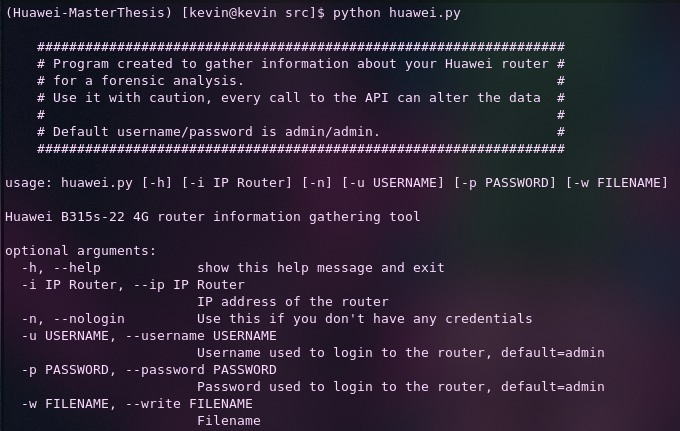

# Huawei-MasterThesis

The goal of the thesis is to gather as much information possible about the Huawei B315s-22 (In a forensic way). For that we decided to create a tool using their API and the wrapper that was created by Salamek https://github.com/Salamek/huawei-lte-api.

Keep in mind that **every action (API Call) will most probably alter the memory of the router**, that's why we need to be careful.

### Installation
We decided to go with a virtual python environment called **pipenv**. That's why if not already installed we will first need to do : `pip install pipenv`

Once pipenv installed, run `git clone https://github.com/0x0D1n/Huawei-MasterThesis.git`, enter your credentials. Now you should have the directory **Huawei-MasterThesis**. We can now `cd` into it and run `pipenv shell` followed by `pipenv install`

We're now ready to use the tool.

### How does it work ?

The default credentials (Username/Password) for a Huawei router is admin/admin. If those are known we can use the following command:
`python huawei.py -i 192.168.8.1 -u admin -p admin`
else
`python huawei.py -i 192.168.8.1 -n`

### What information can be gathered ?

| __Information__   | __Creds required__ |
|-------------------|--------------------|
| ISP                | No     |
| Router Info        | Yes |
| Sim Card Info      | Yes |
| Language Router    | No |
| Connected Devices  | Yes |
| NTP Info           | No |
| Syslog - web       | No |

### Usage Example

